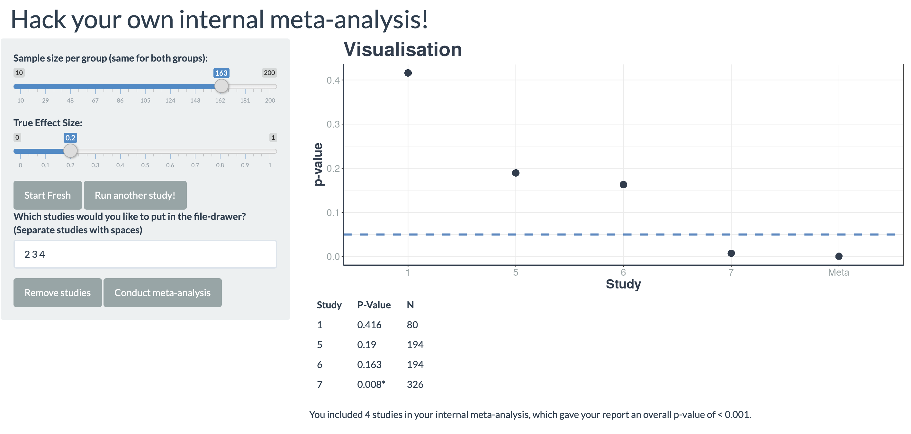

# Hack your own internal meta-analysis!

A Shiny app that highlights flexible termination and inclusion of studies when conducting an internal meta-analysis.

[Click here](https://mnorrbo.shinyapps.io/minimeta_shiny/) to use the app on *shinyapps.io*.

